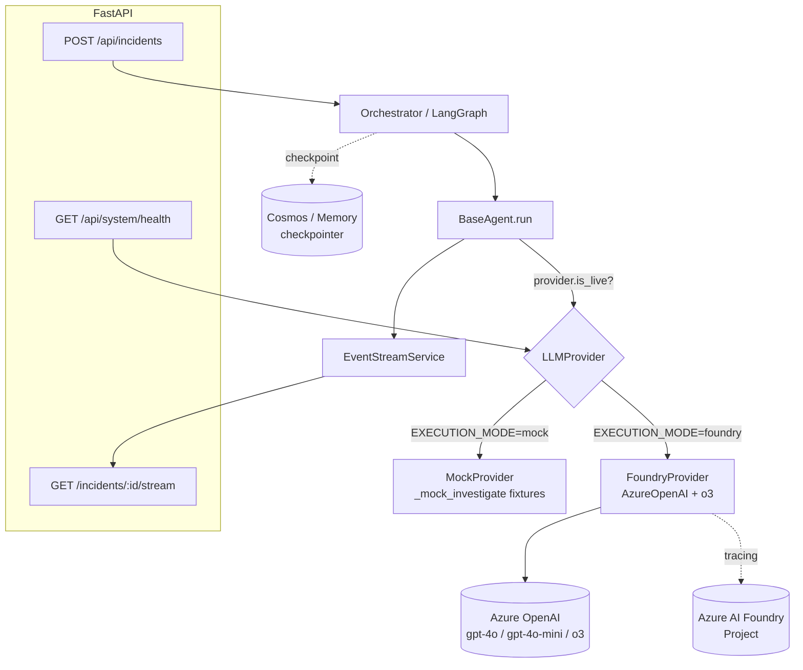

# OpsPilot — Azure AI Foundry Integration: Architecture Report & Implementation Plan

**Author:** Principal AI Architect
**Date:** 2026-06-03
**Status:** Design only — no code changes made (per task constraint #10)
**Scope:** Prepare OpsPilot for Azure AI Foundry integration *without requiring credentials yet*. Deliver an audit, a provider-abstraction design, a LangGraph orchestration design, a model-tier plan (GPT-4o / GPT-4o-mini / o3), env vars, a file-level implementation plan, effort estimates, risks, and a risk/impact-ordered roadmap.

> This document supersedes the raw tool-log artifacts `analysis.md` and `architecture_report.md` (those are leftover session logs, not deliverables). It complements `architecture.md` (the prior high-level design narrative) with a concrete, file-level engineering plan.

---

## 1. Backend Architecture Audit

### 1.1 Component map (as-built)

```
opspilot/backend/app/
├── main.py                     FastAPI app factory; registers /api router + /health
├── config.py                   Pydantic Settings; all Azure creds default to "" (local-safe)
├── api/
│   ├── routes/
│   │   ├── incidents.py        POST /incidents → triggers InvestigationOrchestrator (BackgroundTask)
│   │   ├── stream.py           GET  /incidents/{id}/stream → SSE bridge
│   │   ├── system.py           GET  /system/health (foundryConfigured/executionMode) + POST /agents/test
│   │   ├── agents.py           GET  agent activity (served from agent_service mock)
│   │   ├── timeline.py         GET  timeline (mock)
│   │   └── recommendations.py  GET  recommendations (mock)
│   └── middleware/             auth.py, telemetry.py
├── agents/
│   ├── base.py                 BaseAgent: run() → SSE + branch _investigate / _mock_investigate
│   ├── orchestrator.py         IMPERATIVE pipeline (NOT LangGraph) — fan-out/fan-in by hand
│   ├── graph.py                ⚠ DOCSTRING-ONLY STUB — LangGraph graph never built
│   ├── state.py                OpsPilotState (LangGraph-shaped: add_messages reducer, but unused as graph)
│   ├── commander/              Intake classifier (model_key="commander")
│   ├── metrics/ logs/ deployment/   Specialists (model_key="specialist")
│   ├── time_machine/           CorrelationAgent (model_key="commander")
│   ├── root_cause/             RootCauseAgent (model_key="commander" ⚠ — NOT reasoning/o3)
│   └── recommendation/         RecommendationAgent (model_key="commander")
├── services/
│   ├── foundry.py              FoundryClient: AsyncAzureOpenAI wrapper, is_configured = bool(endpoint)
│   ├── event_stream.py         In-process asyncio.Queue per incident (⚠ not Redis/distributed)
│   ├── incident_service.py     MOCK_INCIDENTS in-memory list + _INDEX
│   ├── agent_service.py        Hardcoded _TASKS_BY_INCIDENT mock activity
│   ├── recommendation_service.py / timeline_service.py   Mock data
│   ├── cosmos_db.py            ⚠ EMPTY (0 bytes) — no persistence
│   └── ai_search.py            ⚠ EMPTY (0 bytes) — no episodic/semantic memory
├── tools/
│   ├── metrics_tools.py        Mock deterministic series (checkout-service)
│   ├── logs_tools.py           Mock deterministic logs
│   ├── deployment_tools.py     Mock deterministic deploy history
│   ├── infra_tools.py          ⚠ DOCSTRING-ONLY STUB (no functions)
│   └── memory_tools.py         ⚠ DOCSTRING-ONLY STUB (no functions)
├── models/                     Pydantic API/domain models (incident, findings, timeline, ...)
└── observability/              logging.py (structlog), telemetry.py, metrics.py
```

### 1.2 Runtime flow (today)

```
POST /api/incidents
   └─ create IncidentRecord → append to MOCK_INCIDENTS
   └─ BackgroundTask: InvestigationOrchestrator.run(id, description, services)
         1. stream.open(id)
         2. emit investigation.started
         3. CommanderAgent.run()                     [intake: severity + affected_services]
         4. asyncio.gather(Metrics, Logs, Deployment) [fan-out, concurrent]
         5. CorrelationAgent.run()                   [fan-in → timeline]
         6. RootCauseAgent.run()                     [→ root_cause.updated event]
         7. RecommendationAgent.run()
         8. emit investigation.complete → stream.close(id)

Each BaseAgent.run():
   emit agent.started
   if foundry.is_configured:  finding = await _investigate(state)   # real LLM
   else:                      finding = await _mock_investigate(state) # canned
   (on exception → fall back to _mock_investigate, confidence −10)
   emit agent.finding + agent.completed
```

Frontend consumes SSE from `GET /api/incidents/{id}/stream` via `useIncidentStream` / `useAgentStream`.

### 1.3 What is real vs. aspirational

| Capability | State | Notes |
|---|---|---|
| FastAPI + routers + SSE | ✅ Real, working | In-process event bus |
| Dual-path agents (real LLM / mock) | ✅ Real | Branch on `is_configured` |
| Per-agent structured-output models | ✅ Real | Pydantic models per agent |
| Azure OpenAI client wrapper | ✅ Real (untested live) | `beta.chat.completions.parse` |
| **LangGraph orchestration** | ❌ **Not built** | `graph.py` is a comment; orchestrator is imperative |
| **o3 reasoning tier** | ❌ **Declared, never used** | `model_for()` returns only commander/specialist |
| **Foundry tracing** | ⚠ Code present, API likely stale | `AIProjectClient(project_name=…)` — see Risk R3 |
| Cosmos persistence | ❌ Empty file | No checkpointer, no incident store |
| AI Search memory | ❌ Empty file | `memory_tools` stubbed |
| Distributed event bus (Redis) | ❌ Declared, unused | In-process only |
| Real telemetry/tools (Azure Monitor, K8s) | ❌ Mock/stub | `infra_tools`, `memory_tools` empty |

### 1.4 Notable inconsistencies (fix during integration)

1. **Confidence scale clash.** `AgentFinding.confidence` and agent outputs use **0–100**; `state.py` docstring + `RootCauseHypothesis.confidence` + the graph's "confidence < 0.7" escalation rule use **0–1**. Pick one (recommend 0–1 internally, format to % at the API edge) before wiring escalation logic.
2. **Root Cause is not a reasoning agent.** `RootCauseAgent.model_key = "commander"` → it runs on GPT-4o, not o3. Task #5 asks for an o3 reasoning agent; this requires a new `model_key`/role.
3. **Two parallel "mock" concepts.** (a) LLM-absent fallback in `BaseAgent`, and (b) mock *tool data* in `tools/*`. These are independent. A provider switch governs (a); a separate tool-source switch governs (b). The design below treats them as distinct knobs.
4. **`is_configured` is implicit.** Execution mode is inferred from "is the endpoint string non-empty?". There is no explicit, testable `EXECUTION_MODE`. Task #7 requires making this explicit.

---

## 2. Mock-Execution Inventory (Task 2)

Every location where mock/deterministic behavior is produced, and what replaces it:

| # | Location | Mechanism | Replaced by |
|---|---|---|---|
| M1 | `agents/base.py:101-104` | `if not foundry.is_configured: _mock_investigate()` | Provider mode switch (§5) |
| M2 | `agents/base.py:113` | Exception fallback → `_mock_investigate()` | Keep as resilience fallback (good behavior) |
| M3 | `agents/*/agent.py` `_mock_investigate()` ×7 | Canned `AgentFinding` per agent | Retained as fixtures; surfaced via `MockProvider` |
| M4 | `services/agent_service.py` | `_TASKS_BY_INCIDENT` hardcoded dict | Live agent activity persisted to Cosmos |
| M5 | `services/incident_service.py` | `MOCK_INCIDENTS` in-memory list | Cosmos incidents container |
| M6 | `services/recommendation_service.py` | Mock recommendations | Live `RecommendationAgent` output |
| M7 | `services/timeline_service.py` | Mock timeline | Live `CorrelationAgent` output |
| M8 | `tools/metrics_tools.py` | Deterministic `MetricSeries` | Azure Monitor / Prometheus client |
| M9 | `tools/logs_tools.py` | Deterministic log rows | Log Analytics (KQL) client |
| M10 | `tools/deployment_tools.py` | Deterministic deploy history | ADO/GitHub/ARM deployment client |
| M11 | `tools/infra_tools.py` | **Stub (no impl)** | K8s / ARM / Service Health client |
| M12 | `tools/memory_tools.py` | **Stub (no impl)** | AI Search episodic/semantic memory |
| M13 | `services/cosmos_db.py` | **Empty** | Cosmos client + LangGraph checkpointer |
| M14 | `services/ai_search.py` | **Empty** | AI Search client |
| M15 | `services/event_stream.py` | In-process queue | Redis pub/sub (multi-replica) |
| M16 | `api/routes/system.py:129,138` | `executionMode = is_configured ? live : mock` | `provider.mode` value |

**Phase priority:** M1/M16 (the execution switch) and M3 (the agent path) are the *only* items needed for Task 7. M8–M14 are deeper integration (post-credential) and out of scope for the credential-free milestone, but the abstraction must not block them.

---

## 3. Azure AI Foundry Integration Architecture (Task 3)

### 3.1 Target topology

```
                         ┌─────────────────────────────────────────────┐
                         │              Azure AI Foundry                │
                         │  (Project workspace = control/observability) │
                         │                                              │
                         │  ┌────────────┐  Model deployments:          │
   FastAPI backend ─────▶│  │  AOAI      │   • gpt-4o      (commander)  │
   (FoundryProvider)     │  │  endpoint  │   • gpt-4o-mini (specialist) │
        │                │  └────────────┘   • o3          (reasoning)  │
        │                │  Tracing / Evals / Prompt mgmt               │
        │                └─────────────────────────────────────────────┘
        │                          ▲                ▲
        │ DefaultAzureCredential    │ OTel spans     │ azure-ai-projects (telemetry.enable)
        │ (managed identity)        │                │
        ▼                          │                │
   ┌─────────────┐   ┌─────────────┴───┐   ┌────────┴────────┐
   │ Cosmos DB   │   │ App Insights /  │   │ Azure AI Search │
   │ (state +    │   │ Monitor (OTel)  │   │ (episodic /     │
   │ checkpoints)│   └─────────────────┘   │  semantic mem)  │
   └─────────────┘                         └─────────────────┘
```

### 3.2 Design principles

- **Auth: managed identity first.** `DefaultAzureCredential` → bearer token for `https://cognitiveservices.azure.com/.default`. API key supported as a dev fallback (`AZURE_OPENAI_API_KEY`). This is already coded in `foundry.py:50-61` — preserve it.
- **Foundry = control plane, AOAI endpoint = data plane.** Chat/parse calls go to the Azure OpenAI endpoint; the Foundry *project* adds tracing, evaluation, and prompt management on top. The integration must work even if only the AOAI endpoint is set (Foundry project optional) — graceful degradation of *observability*, not of *function*.
- **Credential-free today.** Everything ships behind the provider abstraction so `EXECUTION_MODE=mock` is fully functional with zero Azure config. Flipping to `foundry` is a config-only change once credentials exist.
- **One structured-output contract.** All agents already call `_llm_structured(system, user, response_model)`. Keep this as the single seam; the provider implements it. No agent code needs to know which provider is active.

### 3.3 Where the seam goes

Today `BaseAgent` depends on the concrete `FoundryClient`. We invert this: `BaseAgent` depends on an `LLMProvider` interface, and a factory selects the implementation from `EXECUTION_MODE`. The orchestrator and routes resolve the provider via `get_provider()` instead of `get_foundry_client()`.

---

## 4. LangGraph Orchestration Architecture (Task 4)

The current orchestrator is correct but imperative — it cannot checkpoint, replay, conditionally branch, or be inspected node-by-node. The target graph (matching `graph.py`'s docstring intent):

### 4.1 Graph definition

```
                       ┌──────────────────┐
            START ────▶│ commander_intake │  (gpt-4o: severity, services, type)
                       └────────┬─────────┘
                                │ fan-out
          ┌──────────┬──────────┼───────────┬─────────────┐
          ▼          ▼          ▼            ▼             │
   ┌───────────┐┌─────────┐┌────────────┐┌──────────────┐ │  (gpt-4o-mini specialists,
   │ metrics   ││  logs   ││ deployment ││ (infra opt.) │ │   run concurrently)
   └─────┬─────┘└────┬────┘└──────┬─────┘└──────┬───────┘ │
         └───────────┴─────┬──────┴─────────────┘         │
                           ▼  fan-in barrier              │
                  ┌──────────────────┐                    │
                  │ correlation/     │ (gpt-4o: timeline) │
                  │ time_machine     │                    │
                  └────────┬─────────┘                    │
                           ▼                               │
                  ┌──────────────────┐                    │
                  │ root_cause       │ (gpt-4o synthesis) │
                  └────────┬─────────┘                    │
                           ▼  conditional edge            │
              confidence < 0.7 ?                          │
               ┌───────────┴────────────┐                 │
               ▼ yes                     ▼ no              │
      ┌──────────────────┐      ┌──────────────────┐      │
      │ deep_reasoning   │      │ recommendation   │◀─────┘
      │ (o3)             │──────▶│ (gpt-4o)         │
      └──────────────────┘      └────────┬─────────┘
                                          ▼
                                 ┌──────────────────┐
                                 │ output_formatter │
                                 └────────┬─────────┘
                                          ▼
                                         END
```

### 4.2 Node ↔ agent mapping

| Graph node | Agent class | Model tier | Reads | Writes (state keys) |
|---|---|---|---|---|
| `commander_intake` | `CommanderAgent` | gpt-4o | description | `severity`, `affected_services` |
| `metrics_agent` | `MetricsAgent` | gpt-4o-mini | services | `metrics_findings` |
| `logs_agent` | `LogsAgent` | gpt-4o-mini | services | `logs_findings` |
| `deployment_agent` | `DeploymentAgent` | gpt-4o-mini | services | `deployment_findings` |
| `time_machine` | `CorrelationAgent` | gpt-4o | 3 findings | `timeline` |
| `root_cause` | `RootCauseAgent` | gpt-4o | findings+timeline | `root_cause`, `blast_radius` |
| `deep_reasoning` | **new** `DeepReasoningAgent` | **o3** | full state | `root_cause` (refined) |
| `recommendation` | `RecommendationAgent` | gpt-4o | root_cause | `recommendations` |
| `output_formatter` | (function node) | — | full state | `executive_summary`, `completed_at` |

### 4.3 Conditional escalation

`root_cause → {deep_reasoning | recommendation}` via a router function reading `state.root_cause.primary.confidence`:

```python
def route_after_root_cause(state: OpsPilotState) -> str:
    rc = state.root_cause
    if rc is None or rc.primary.confidence < REASONING_ESCALATION_THRESHOLD:  # default 0.7
        return "deep_reasoning"
    return "recommendation"
```

This is the *only* place o3 is invoked — keeping the expensive reasoning model off the hot path unless confidence is low. (Resolve the 0–1 vs 0–100 scale issue first — see §1.4.1.)

### 4.4 Checkpointing & SSE

- **Checkpointer:** `langgraph.checkpoint` with a Cosmos-backed saver (or `MemorySaver` until Cosmos is wired). Enables pause/resume/replay (`thread_id = incident_id`).
- **SSE during graph execution:** LangGraph node callbacks emit the same SSE event shapes the frontend already consumes. Two viable approaches:
  - **(Recommended, low-risk)** Keep agents emitting via `EventStreamService` inside their nodes — no event-shape change, frontend untouched.
  - (Later) Use `graph.astream(..., stream_mode="updates")` and translate node updates into SSE frames centrally.
- **Migration strategy:** Build the graph *behind* a flag (`ORCHESTRATOR=graph|legacy`). The legacy imperative orchestrator stays as a fallback until the graph is proven. This de-risks the rewrite.

---

## 5. Provider Abstraction Layer (Task 7)

### 5.1 Goal

A single seam that lets the system switch among **Mock** and **Azure AI Foundry** (and trivially add **Replay** later) via one config value, with no agent code changes.

### 5.2 New package: `app/providers/`

```
app/providers/
├── __init__.py
├── base.py        ExecutionMode enum + ModelRole enum + LLMProvider (ABC/Protocol)
├── mock.py        MockProvider
├── foundry.py     FoundryProvider  (moved/renamed from services/foundry.py logic)
└── factory.py     get_provider() — caches a singleton chosen by EXECUTION_MODE
```

### 5.3 Interface (`base.py`)

```python
class ExecutionMode(str, Enum):
    MOCK = "mock"
    FOUNDRY = "foundry"
    AUTO = "auto"          # foundry if endpoint present, else mock

class ModelRole(str, Enum):
    COMMANDER = "commander"      # gpt-4o
    SPECIALIST = "specialist"    # gpt-4o-mini
    REASONING = "reasoning"      # o3   ← NEW, fixes the unused-o3 gap

class LLMProvider(ABC):
    mode: ExecutionMode

    @property
    @abstractmethod
    def is_live(self) -> bool: ...

    @abstractmethod
    def model_for(self, role: ModelRole) -> str: ...

    @abstractmethod
    async def structured_chat(self, messages, role: ModelRole,
                              response_model: type[T]) -> T: ...

    @abstractmethod
    async def plain_chat(self, messages, role: ModelRole) -> str: ...
```

> Note the signature change: `role: ModelRole` replaces today's raw `model_deployment: str`. The provider owns the role→deployment mapping (and now includes `REASONING`). This removes deployment-name knowledge from agents.

### 5.4 `MockProvider`

Two layering options — **recommend Option B** (least invasive, preserves the rich demo fixtures):

- **Option A — generic LLM mock:** `structured_chat` returns canned `response_model` instances from a fixture registry keyed by `(role, model_name)`. Requires building a fixture registry; agents drop `_mock_investigate`.
- **Option B — keep agent fixtures (RECOMMENDED):** `MockProvider.is_live == False`. `BaseAgent.run()` branches on `self._provider.is_live` (replacing `is_configured`). When not live, it calls the existing `_mock_investigate()`. The provider abstraction governs *which client* and the *explicit mode*; the per-agent canned fixtures remain the deterministic demo source. Minimal churn, demo stays identical.

`structured_chat`/`plain_chat` on `MockProvider` raise `NotImplementedError` (they're never reached in Option B because `run()` short-circuits to `_mock_investigate`). `model_for` returns the configured deployment names so `/system/health` still reports them.

### 5.5 `FoundryProvider`

Exactly today's `FoundryClient` logic, renamed and conformed to the interface:
- `is_live` ← `bool(endpoint)`.
- `model_for(ModelRole.REASONING)` → `settings.reasoning_model_deployment` (**new path**).
- `structured_chat` maps `role → deployment` then calls `beta.chat.completions.parse`.
- Foundry tracing init preserved (but see Risk R3 — verify the `AIProjectClient` constructor against the installed SDK).

### 5.6 `factory.py`

```python
@lru_cache
def get_provider() -> LLMProvider:
    s = get_settings()
    mode = ExecutionMode(s.execution_mode)
    if mode is ExecutionMode.AUTO:
        mode = ExecutionMode.FOUNDRY if s.azure_openai_endpoint else ExecutionMode.MOCK
    return FoundryProvider() if mode is ExecutionMode.FOUNDRY else MockProvider()
```

### 5.7 Backward-compatibility shim

Keep `services/foundry.py:get_foundry_client()` as a thin alias to `get_provider()` for one release so `orchestrator.py`, `system.py`, and `base.py` keep importing without breakage, then migrate call sites. This lets the abstraction land in one PR and call-site cleanup in the next.

---

## 6. Model-Tier Implementation Plan (Task 5)

| Agent | Role | Deployment | Why | Change required |
|---|---|---|---|---|
| Commander (intake + synthesis) | `COMMANDER` | **gpt-4o** | Multi-source synthesis, classification, JSON discipline | None (already commander) |
| Metrics / Logs / Deployment | `SPECIALIST` | **gpt-4o-mini** | Narrow, tool-grounded, cost-sensitive, run ×3 concurrently | None (already specialist) |
| Correlation / Recommendation | `COMMANDER` | **gpt-4o** | Cross-finding reasoning | None |
| **Root Cause** | **`REASONING`** | **o3** | Deep causal reasoning; the showcase "Reasoning Agent" | **Change `model_key`** + add escalation, OR keep gpt-4o for primary pass and add a separate `deep_reasoning` o3 node |
| **Deep Reasoning (new)** | `REASONING` | **o3** | Conditional escalation when confidence < threshold | **New agent class + graph node** |

**Recommended pattern:** keep `RootCauseAgent` on gpt-4o for the *first* synthesis pass (fast, cheap), and add a dedicated **`DeepReasoningAgent` on o3** invoked *only* via the conditional edge when confidence is low. This:
- Gives a clean, demonstrable "o3 reasoning" story for the hackathon's reasoning track.
- Keeps o3 (slow, costly, no structured-output parity) off the default path.
- Isolates o3-specific quirks (see Risk R5) to one agent.

**o3-specific handling:** o3 reasoning models don't support `temperature` and historically have limited/different structured-output support and use `max_completion_tokens`. The `FoundryProvider.structured_chat` must special-case `ModelRole.REASONING` (e.g. fall back to JSON-mode + manual `model_validate`, omit unsupported params). Encapsulate entirely in the provider.

---

## 7. Environment Variables (Task 6)

### 7.1 New variables to add to `config.py` + `.env.example`

```bash
# ── Execution mode (provider switch) ─────────────────────────────────────────
# mock    = no Azure calls, deterministic fixtures (DEFAULT, credential-free)
# foundry = call Azure AI Foundry / Azure OpenAI
# auto    = foundry if AZURE_OPENAI_ENDPOINT set, else mock
EXECUTION_MODE=mock

# ── Orchestrator engine ──────────────────────────────────────────────────────
# legacy = current imperative orchestrator (DEFAULT until graph proven)
# graph  = LangGraph state machine with checkpointing
ORCHESTRATOR=legacy

# ── Reasoning escalation ─────────────────────────────────────────────────────
# Root-cause confidence (0.0–1.0) below which the o3 deep_reasoning node fires
REASONING_ESCALATION_THRESHOLD=0.7
REASONING_MODEL_DEPLOYMENT=o3        # (already present; now actually used)

# ── LangGraph checkpointing ──────────────────────────────────────────────────
# memory = in-process (DEFAULT); cosmos = durable, resumable
LANGGRAPH_CHECKPOINTER=memory

# ── Event bus ────────────────────────────────────────────────────────────────
# memory = in-process asyncio queues (DEFAULT, single replica)
# redis  = Redis pub/sub (multi-replica) — uses REDIS_URL
EVENT_BUS=memory
```

### 7.2 Already present (no change)

`AZURE_OPENAI_ENDPOINT`, `AZURE_OPENAI_API_KEY`, `AZURE_OPENAI_API_VERSION`, `COMMANDER_MODEL_DEPLOYMENT`, `SPECIALIST_MODEL_DEPLOYMENT`, `AZURE_AI_FOUNDRY_PROJECT_NAME`, `AZURE_AI_FOUNDRY_RESOURCE_GROUP`, `AZURE_SUBSCRIPTION_ID`, `COSMOS_DB_*`, `AZURE_SEARCH_*`, `REDIS_URL`, `API_*`, `LOG_LEVEL`.

### 7.3 Defaults guarantee credential-free operation

With `EXECUTION_MODE=mock`, `ORCHESTRATOR=legacy`, `LANGGRAPH_CHECKPOINTER=memory`, `EVENT_BUS=memory` and all Azure vars empty, the app runs exactly as today. Every new var has a safe default; nothing breaks for a developer who pulls and runs.

---

## 8. File-Level Implementation Plan

Ordered to land the provider switch first (lowest risk, satisfies Task 7), then o3, then LangGraph.

### 8.1 Provider abstraction (Milestone A)

| File | Action | Detail |
|---|---|---|
| `app/providers/__init__.py` | **Create** | Export `get_provider`, `LLMProvider`, `ExecutionMode`, `ModelRole` |
| `app/providers/base.py` | **Create** | Enums + `LLMProvider` ABC (§5.3) |
| `app/providers/mock.py` | **Create** | `MockProvider` (Option B, §5.4) |
| `app/providers/foundry.py` | **Create** | Move `FoundryClient` logic; add `REASONING` mapping |
| `app/providers/factory.py` | **Create** | `get_provider()` from `EXECUTION_MODE` (§5.6) |
| `app/config.py` | **Edit** | Add `execution_mode`, `orchestrator`, `reasoning_escalation_threshold`, `langgraph_checkpointer`, `event_bus` |
| `app/services/foundry.py` | **Edit** | Reduce to compat shim: `get_foundry_client()` → `get_provider()` |
| `app/agents/base.py` | **Edit** | Constructor takes `LLMProvider`; `run()` branches on `provider.is_live`; `_model()` uses `ModelRole` |
| `app/agents/orchestrator.py` | **Edit** | `get_provider()` instead of `get_foundry_client()` |
| `app/api/routes/system.py` | **Edit** | `executionMode` ← `provider.mode.value`; report `reasoningModel` |
| `app/.env.example` + root `.env.example` | **Edit** | Add §7.1 vars |
| `tests/unit/test_providers.py` | **Create** | Mode resolution (mock/foundry/auto), role→deployment mapping, `is_live` |

### 8.2 o3 reasoning tier (Milestone B)

| File | Action | Detail |
|---|---|---|
| `app/agents/base.py` | **Edit** | Support `model_key="reasoning"` → `ModelRole.REASONING` |
| `app/agents/deep_reasoning/__init__.py` | **Create** | Package |
| `app/agents/deep_reasoning/agent.py` | **Create** | `DeepReasoningAgent(model_key="reasoning")` + `_mock_investigate` |
| `app/agents/deep_reasoning/prompts.py` | **Create** | o3 chain-of-thought refinement prompt |
| `app/providers/foundry.py` | **Edit** | o3 special-casing in `structured_chat` (Risk R5) |
| `app/agents/orchestrator.py` | **Edit** | Insert conditional o3 escalation after root_cause (legacy path) |
| `app/agents/state.py` | **Edit** | Standardize confidence scale to 0–1 (§1.4.1) |
| `tests/unit/test_agents.py` | **Edit** | Add deep-reasoning + escalation tests (mock mode) |

### 8.3 LangGraph orchestration (Milestone C)

| File | Action | Detail |
|---|---|---|
| `app/agents/graph.py` | **Replace stub** | Build `StateGraph(OpsPilotState)`, nodes, edges, conditional router, `.compile(checkpointer=...)` |
| `app/agents/orchestrator.py` | **Edit** | When `ORCHESTRATOR=graph`, drive `graph.astream`; else legacy |
| `app/services/cosmos_db.py` | **Create (fill)** | Cosmos client + LangGraph checkpointer (when `LANGGRAPH_CHECKPOINTER=cosmos`) |
| `tests/integration/test_incident_flow.py` | **Edit** | Assert graph path emits identical SSE sequence as legacy |

### 8.4 Deeper integration (Milestone D — post-credential, out of current scope)

`services/ai_search.py`, `tools/memory_tools.py`, `tools/infra_tools.py`, real `tools/metrics_tools.py`/`logs_tools.py`/`deployment_tools.py` clients, `EVENT_BUS=redis` in `event_stream.py`.

---

## 9. Architecture Diagram (Task 8)

### 9.1 Provider abstraction (Mermaid)



### 9.2 Execution-mode decision (ASCII)

```
get_provider()
   │
   ├─ EXECUTION_MODE = mock     ─────────────▶ MockProvider     (is_live=False) ─▶ _mock_investigate()
   ├─ EXECUTION_MODE = foundry  ─────────────▶ FoundryProvider  (is_live=True)  ─▶ _investigate() → AOAI
   └─ EXECUTION_MODE = auto
            │
            ├─ AZURE_OPENAI_ENDPOINT set?  yes ▶ FoundryProvider
            └─ no                              ▶ MockProvider
```

---

## 10. Implementation Roadmap (Task 9 — ordered by risk × impact)

| Phase | Milestone | Impact | Risk | Why this order |
|---|---|---|---|---|
| **P1** | **A — Provider abstraction + `EXECUTION_MODE`** | 🔴 High | 🟢 Low | Directly satisfies Task 7; pure refactor behind a flag; mock path unchanged; unblocks everything else. Ship first. |
| **P2** | **B — o3 reasoning tier (`DeepReasoningAgent` + escalation, mock-first)** | 🔴 High | 🟡 Med | High demo value ("reasoning agent"). Mock path testable with zero credentials. Confidence-scale cleanup is a prerequisite. |
| **P3** | **Live smoke test (FoundryProvider) once credentials arrive** | 🔴 High | 🟡 Med | Validates `beta.parse`, managed identity, o3 quirks (R5), tracing (R3). Config-only flip; no code change if A/B are solid. |
| **P4** | **C — LangGraph orchestration behind `ORCHESTRATOR=graph`** | 🟡 Med | 🔴 High | Biggest rewrite; legacy fallback de-risks it. Enables checkpoint/replay/conditional branching. Do after the model layer is stable. |
| **P5** | **Cosmos checkpointer + incident persistence** | 🟡 Med | 🟡 Med | Durability + resumable investigations. Needs Cosmos credentials. |
| **P6** | **D — Real tools + AI Search memory + Redis bus** | 🟢 Lower (demo) | 🔴 High | Most external dependencies; least needed for a credential-free hackathon demo. Last. |

**Critical path to "Foundry-ready without credentials":** P1 + P2 only. After those, `/api/system/health` can report `foundryConfigured=false, executionMode=mock` *by explicit configuration* (not by accident), and flipping `EXECUTION_MODE=foundry` + setting the endpoint is the entire activation step.

---

## 11. Estimated Effort

Assumes one experienced engineer; "live" tasks assume credentials available.

| Milestone | Tasks | Effort | Credentials needed? |
|---|---|---|---|
| A — Provider abstraction | 5 new files, 6 edits, unit tests | **1.5–2 days** | No |
| B — o3 reasoning tier (mock-first) | new agent, escalation, scale cleanup, tests | **1.5–2 days** | No |
| Confidence-scale standardization | state + agents + API edge | **0.5 day** | No |
| P3 — Live Foundry smoke test | config + debugging parse/auth/o3/tracing | **1–2 days** | **Yes** |
| C — LangGraph orchestration | rebuild graph.py, dual-path orchestrator, integration tests | **3–4 days** | No (memory checkpointer) |
| P5 — Cosmos checkpointer + persistence | fill cosmos_db.py, wire saver | **2–3 days** | **Yes** |
| D — Real tools + memory + Redis | 5 tool clients, AI Search, Redis bus | **5–8 days** | **Yes** |
| **Credential-free milestone (A + B + scale)** | — | **~4 days** | **No** |

---

## 12. Risks

| ID | Risk | Likelihood | Impact | Mitigation |
|---|---|---|---|---|
| **R1** | Provider refactor breaks existing call sites (`orchestrator`, `system`, `base`) | Med | High | Compat shim (§5.7); land abstraction + call-site migration in separate PRs; run full test suite in mock mode. |
| **R2** | Confidence-scale clash (0–1 vs 0–100) makes escalation misfire | High | Med | Standardize to 0–1 internally **before** wiring escalation; format to % only at API edge; add a unit test on the threshold. |
| **R3** | Foundry tracing `AIProjectClient(project_name=, resource_group_name=, subscription_id=)` signature is stale vs installed `azure-ai-projects 1.0.0b+` (newer SDK is endpoint-based) | High | Med | Verify against installed SDK before relying on it; wrap in try/except (already done); treat tracing as optional, never block function. |
| **R4** | `beta.chat.completions.parse` unavailable/changed for the pinned `openai`/API version | Med | High | Pin a known-good `AZURE_OPENAI_API_VERSION` (≥2024-08-01-preview); provider-level fallback to JSON mode + manual `model_validate`. |
| **R5** | o3 rejects `temperature`/structured-output params; uses `max_completion_tokens`; slower/costlier | High | Med | Special-case `ModelRole.REASONING` in `FoundryProvider`; JSON-mode fallback; keep o3 off hot path (conditional edge only). |
| **R6** | LangGraph rewrite diverges from working imperative flow / changes SSE shapes → frontend breakage | Med | High | `ORCHESTRATOR=legacy` default + flag; integration test asserts identical SSE event sequence; agents keep emitting via `EventStreamService`. |
| **R7** | In-process event bus + in-process incident store break under multi-replica Azure Container Apps | Med (prod) | High | Document single-replica constraint now; gate scale-out on `EVENT_BUS=redis` + Cosmos persistence (P5/P6). |
| **R8** | Cost blow-up if o3/gpt-4o run on every incident | Low | Med | Tiering (mini specialists), o3 only via escalation, mock default; add token/cost logging in provider. |
| **R9** | Managed-identity token scope/role misconfig in cloud | Med | Med | Document required role (Cognitive Services OpenAI User); API-key dev fallback already supported. |
| **R10** | Secrets accidentally committed via `.env` | Low | High | `.gitignore` already excludes `.env`; keep creds in Key Vault refs (infra/bicep already has keyVault module). |

---

## 13. Summary

OpsPilot's backend is a **well-structured FastAPI + dual-path agent system** whose Foundry "wiring" is largely *declared but not yet active*: LangGraph is a stub, o3 is configured but never called, persistence/memory files are empty, and the mock switch is an implicit `is_configured` boolean rather than an explicit mode.

The path to **Foundry-ready-without-credentials** is short and low-risk:
1. **Introduce `app/providers/`** with an explicit `EXECUTION_MODE` switch (Mock / Foundry / Auto) — Task 7. *(~2 days, no credentials.)*
2. **Add the o3 reasoning tier** as a conditional escalation agent, fixing the confidence-scale inconsistency along the way. *(~2 days, no credentials.)*

Both ship behind flags with mock as the default, so `foundryConfigured=false, executionMode=mock` becomes a *deliberate, tested configuration*. Activating Foundry later is a config-only change. LangGraph, Cosmos persistence, and real tool clients follow as higher-risk, credential-dependent phases (P4–P6), each isolated behind its own flag with a working fallback.
```
