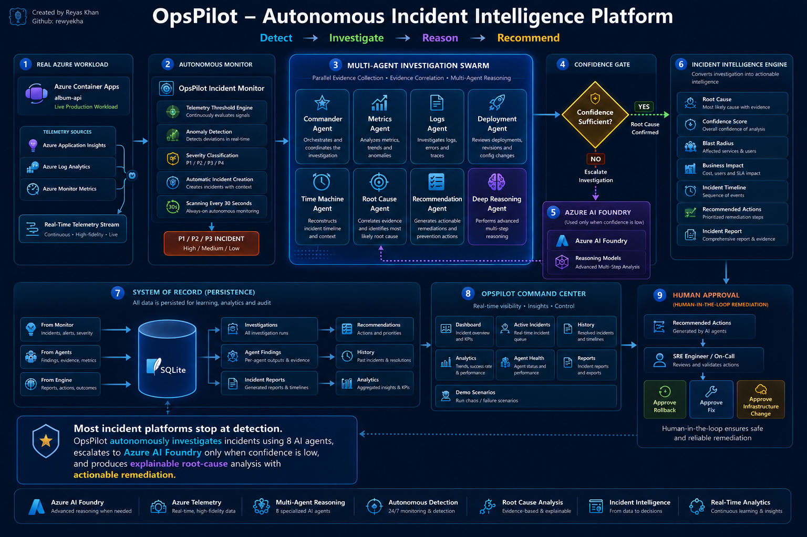

<div align="center">

# 🛡️ OpsPilot

### Autonomous Multi-Agent SRE Command Center

*From production incident to confidence-scored root cause in under five minutes.*

[](https://innovationstudio.microsoft.com/hackathons/Agents-League-Hackathon)
[](https://ai.azure.com/)
[](#the-differentiator-confidence-gated-reasoning-escalation)

[](https://github.com/rewyekha/OpsPilot/actions/workflows/docker-ghcr.yml)

[](https://www.python.org/)
[](https://fastapi.tiangolo.com/)
[](https://langchain-ai.github.io/langgraph/)
[](https://react.dev/)
[](https://www.typescriptlang.org/)
[](https://github.com/rewyekha?tab=packages)

<br>

**Author — Reyas Khan**

[](https://github.com/rewyekha)
[](https://reyaskhan.me)
[](https://learn.microsoft.com/en-us/users/reyaskhanm-9092/)

</div>

---

## The problem

When production breaks, an on-call engineer manually pivots across metrics, logs,
deployments, and incident history under pressure — a slow, tribal, error-prone
scramble while every minute costs revenue and trust.

## What OpsPilot does

OpsPilot turns that scramble into an autonomous, evidence-backed investigation.
A **Commander** agent dispatches a team of specialized AI agents that investigate
**in parallel**, correlate their evidence into a causal timeline, determine a
**confidence-scored root cause**, and propose ranked, executable remediations —
all streamed live to an Azure-Portal-style command centre over Server-Sent Events.

| | Traditional on-call | OpsPilot |
|---|---|---|
| Time to root cause | 30–60+ min | **< 5 min** |
| Evidence gathering | Serial, manual | **Parallel, autonomous** |
| Root cause | Tribal guess | **Confidence-scored hypothesis** |
| Remediation | Ad hoc | **Ranked, executable fixes** |

---

## Demo

> 📹 **Product walkthrough** — a full incident, from detection to resolution.

<div align="center">

[](https://youtu.be/YhKYpFUNweo)

▶️ **[Watch the full demo on YouTube](https://youtu.be/YhKYpFUNweo)**

</div>

---

## The differentiator: confidence-gated reasoning escalation

After root-cause analysis, OpsPilot computes a **combined confidence score**. Only
when it falls below threshold (default 70) does it route the full context to the
**o4-mini** reasoning model, which re-examines the evidence from first principles
and returns a refined root cause plus a complete reasoning trace. Frontier
reasoning stays **off the hot path** unless it's actually needed — governing cost
and latency by design. This is intelligent model routing, not brute force.

| Agent | Role | Model |
|-------|------|-------|
| Commander | Orchestration & synthesis | GPT-4o |
| Metrics / Logs / Deployment | Parallel evidence gathering | GPT-4o-mini |
| Time Machine | Causal event timeline | GPT-4o |
| Root Cause | Confidence-scored hypothesis | GPT-4o |
| Deep Reasoning | First-principles re-analysis (escalation) | o4-mini |
| Recommendation | Ranked, executable remediations | GPT-4o-mini |

Agents are routed by role to configurable **Azure AI Foundry** deployments and
orchestrated as a compiled **LangGraph** `StateGraph` with conditional escalation
edges. A provider abstraction runs the whole system in **zero-credential mock
mode**, then flips a single env var for live Foundry inference.

---

## Run it (for judges)

OpsPilot runs in **zero-credential mock mode by default** — no Azure account
needed to evaluate the full experience. Every path opens the app at
**http://localhost:3000**.

> First, from the repository root: `cp .env.example .env`
> The defaults in `.env.example` select mock mode, so this just works.

### Option A — Prebuilt images from GHCR (fastest, no build)

```bash
cp .env.example .env
docker compose -f docker-compose.ghcr.yml up
```

Or pull the images directly:

```bash
docker pull ghcr.io/rewyekha/opspilot-backend:latest
docker pull ghcr.io/rewyekha/opspilot-frontend:latest
```

### Option B — Build from source with Docker

```bash
cp .env.example .env
docker compose -f docker-compose.yml up --build
```

### Option C — Local dev (hot reload)

```bash
cd backend && python -m uvicorn app.main:app --reload --port 8000  # mock mode, no credentials
cd frontend && npm install && npm run dev
```

### Bring your own Azure AI Foundry credentials (live mode)

Edit `.env`:

```bash
EXECUTION_MODE=foundry
FOUNDRY_ENDPOINT=https://<your-resource>.openai.azure.com/
FOUNDRY_API_KEY=<your-key>            # or leave empty to use managed identity
COMMANDER_MODEL_DEPLOYMENT=gpt-4o
SPECIALIST_MODEL_DEPLOYMENT=gpt-4o-mini
REASONING_MODEL_DEPLOYMENT=o4-mini
```

Then re-run any option above. See [`backend/.env.example`](backend/.env.example)
for the full variable list (all optional except `FOUNDRY_ENDPOINT` in live mode).

---

## Container images

| Image | Registry path |
|-------|---------------|
| Backend (FastAPI + LangGraph) | `ghcr.io/rewyekha/opspilot-backend` |
| Frontend (React + nginx) | `ghcr.io/rewyekha/opspilot-frontend` |

Built and published on every push to `main` by
[`.github/workflows/docker-ghcr.yml`](.github/workflows/docker-ghcr.yml) using the
built-in `GITHUB_TOKEN` — no external secrets. Tags: `latest`, the short commit
SHA, and semantic-version tags on `v*` releases.

---

## Repository layout

```
.
├── backend/            # FastAPI + LangGraph agent runtime (Python 3.12)
├── frontend/           # React + TypeScript + Fluent UI v9 (nginx in prod)
├── infra/              # Azure Bicep infrastructure-as-code
├── evaluation/         # Foundry evaluation datasets and runners
├── demo-workloads/     # Sample apps used to generate real incidents
├── docs/               # architecture diagram assets
├── docker-compose*.yml # local / prebuilt run configurations
└── .github/workflows/  # CI/CD (Docker → GHCR)
```

## Tech stack

`React 18` · `TypeScript` · `Fluent UI v9` · `FastAPI` · `Python 3.12` ·
`LangGraph` · `Azure AI Foundry` · `Azure OpenAI` · `Docker` · `GitHub Actions`

<div align="center">

---

**Built for the Microsoft Agents League Hackathon** · Reasoning Agents Track

</div>
